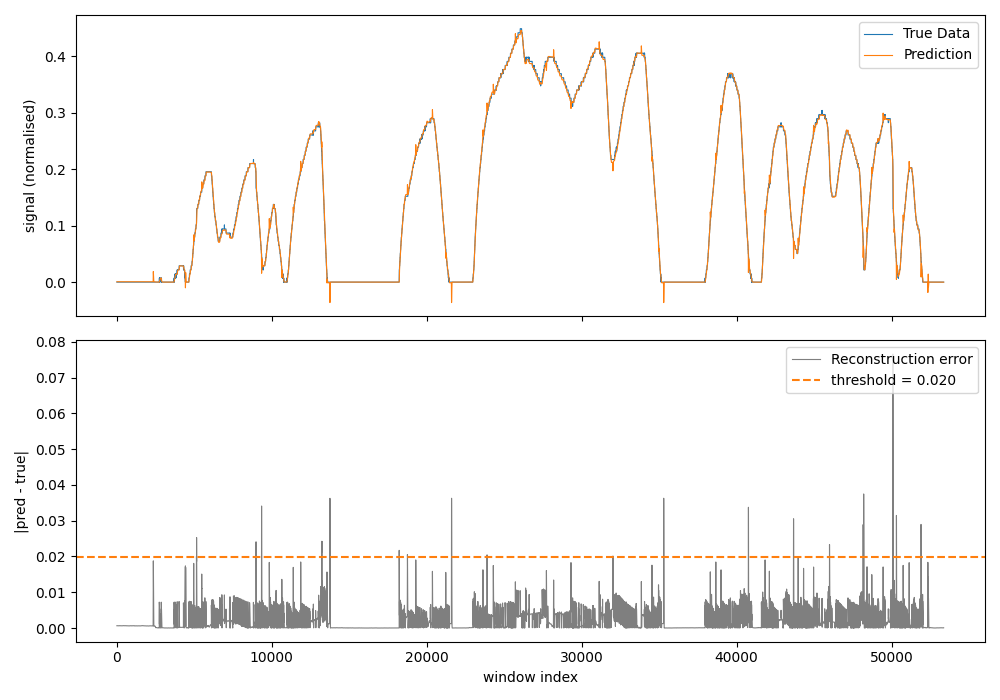
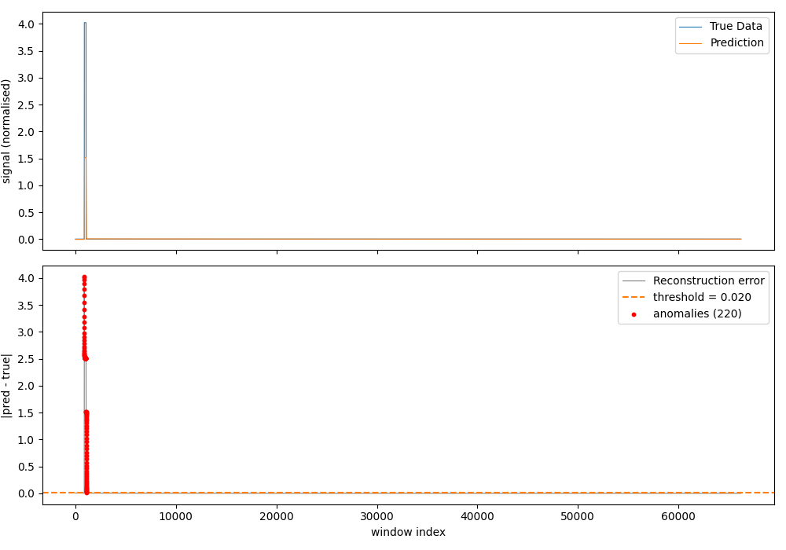
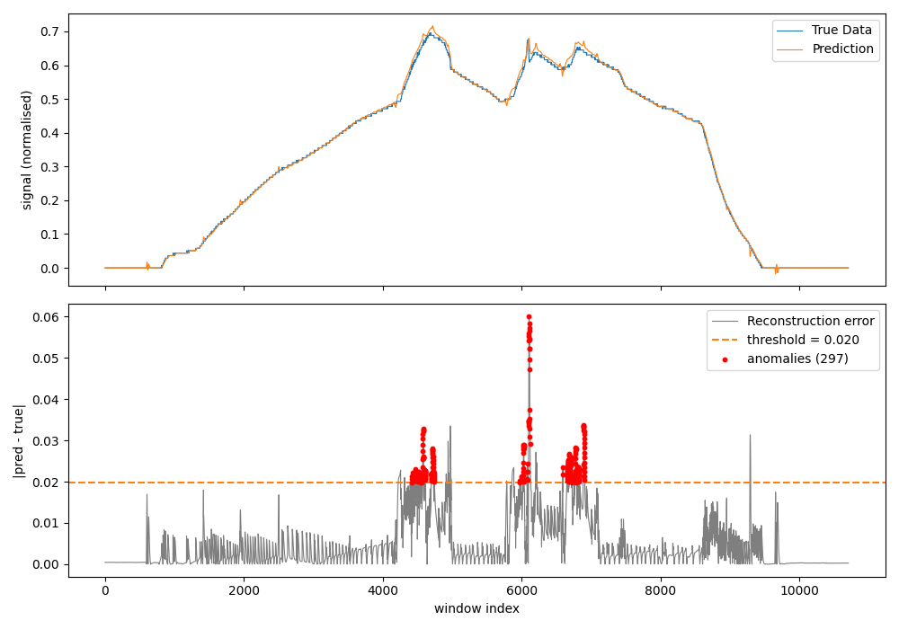
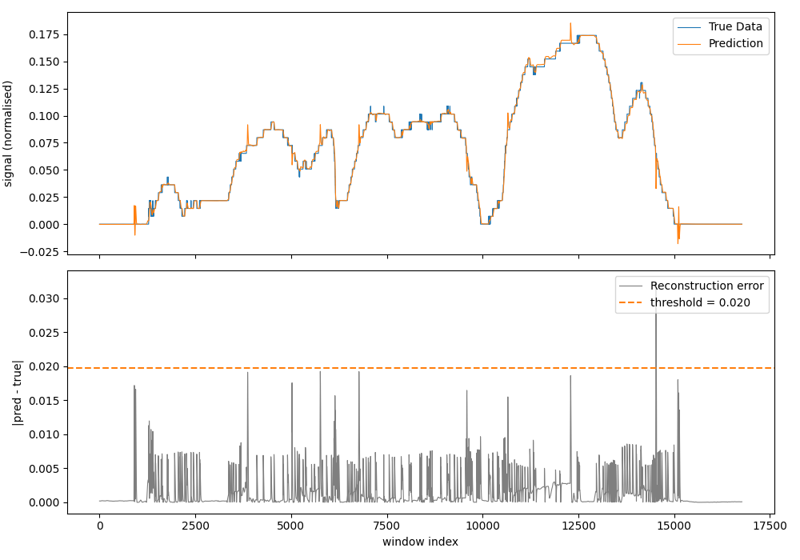
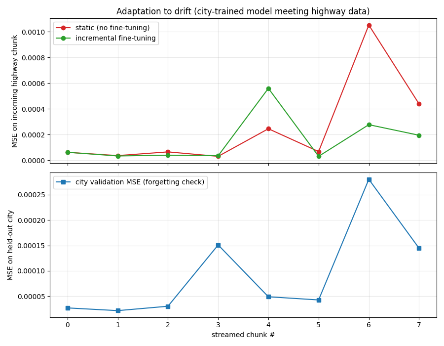

# CAN Anomaly Detector

A hybrid platform for anomaly detection on vehicle CAN bus data. The system architecture supports three independent detection layers — statistical analysis, SLTL formal verification, and LSTM-based deep learning — running in parallel. The LSTM predictor is the primary contribution of this project; the statistical and SLTL components provide the integration scaffolding and a baseline for comparison.

[](https://isocpp.org/)
[](https://python.org/)
[](https://en.wikipedia.org/wiki/C_(programming_language))
[](https://doc.qt.io/qt-6/qmake-manual.html)
[](./LICENSE)

---

## Table of Contents

- [Overview](#overview)
- [Detection Layers](#detection-layers)
- [Architecture](#architecture)
- [Tech Stack](#tech-stack)
- [Project Structure](#project-structure)
- [Installation](#installation)
- [Usage](#usage)
- [Input Formats](#input-formats)
- [FAQ](#faq)
- [Author](#author)
- [License](#license)

---

## Overview

CAN Anomaly Detector reads raw CAN frames from live hardware interfaces, `candump` log files, Arduino serial proxies, or CSV datasets, and routes them through a multi-layer detection pipeline. Anomalies detected by any layer are logged to CSV with timestamps and metadata.

**Intended use cases:**

- Automotive cybersecurity research
- CAN bus intrusion detection
- Vehicle health monitoring
- Educational projects in embedded systems and time-series ML

---

## Detection Layers

| Layer | Method                                                                         | Status                |
| ----- | ------------------------------------------------------------------------------ | --------------------- |
| 1     | Statistical — Z-score / threshold-based outlier detection                     | Scaffolding           |
| 2     | SLTL — Signal Linear Temporal Logic formal property verification              | Scaffolding           |
| 3     | **LSTM — Deep learning sequence model for temporal anomaly prediction** | **Implemented** |

The LSTM predictor (`AnomalyPredictorLSTM`, `LSTMAnomaly.py`) is the primary implementation in this project. Layers 1 and 2 establish the pluggable multi-predictor interface and provide structural context; their logic is partial and serves as a baseline reference.

---

## Architecture

```
┌──────────────────────────────────────────────────────────────┐
│                        Data Receivers                        │
│  ┌─────────────┐ ┌──────────────┐ ┌────────────────────────┐ │
│  │ CANDump     │ │ Arduino      │ │ File / FileDir /       │ │
│  │ Receiver    │ │ Proxy        │ │ Streaming Receiver     │ │
│  └──────┬──────┘ └──────┬───────┘ └───────────┬────────────┘ │
└─────────┼───────────────┼────────────────────┼──────────────┘
          └───────────────┴────────────────────┘
                          │
               ┌──────────▼──────────┐
               │  AutoDetecting      │
               │  Receiver           │
               └──────────┬──────────┘
                          │
               ┌──────────▼──────────┐
               │  CarDataProcessor   │
               │  Thread             │
               └──────────┬──────────┘
          ┌───────────────┼────────────────────┐
          ▼               ▼                    ▼
┌─────────────┐  ┌──────────────┐   ┌──────────────────┐
│  Statistical│  │    SLTL      │   │   LSTM Predictor │
│  Predictor  │  │  Predictor   │   │  (Python/ONNX)   │
│ (scaffolding│  │ (scaffolding)│   │  ← implemented   │
└──────┬──────┘  └──────┬───────┘   └────────┬─────────┘
       └────────────────┴──────────────────────┘
                          │
               ┌──────────▼──────────┐
               │   CSV Anomaly       │
               │   Logger            │
               └─────────────────────┘
```

The multithreaded architecture uses Qt's thread model — worker threads, processor threads, and fetcher threads — to decouple ingestion from prediction.

---

## Tech Stack

| Component                 | Technology                                      |
| ------------------------- | ----------------------------------------------- |
| Core application          | C++17                                           |
| Build system              | QMake (Qt Project)                              |
| Threading & I/O           | Qt 5/6 (`QThread`, `QMutex`, `QFile`)     |
| Formal verification layer | SLTL — custom C++ scaffolding                  |
| ML model training         | Python 3, TensorFlow / Keras (LSTM autoencoder) |
| ML model runtime          | C++ inference via loaded model or subprocess    |
| Hardware interface        | Arduino serial proxy (CAN-to-USB bridge)        |
| Log format                | `candump` (SocketCAN)                         |
| Output format             | CSV                                             |
| IDE support               | Qt Creator, Visual Studio, VS Code              |

---

## Project Structure

```
CAN-Anomaly-Detector/
│
├── main.cpp
│
├── # Data Receivers
├── datareceiver.{h,cpp}              # Abstract receiver interface
├── autodetectingreceiver.{h,cpp}     # Auto-selects receiver by source type
├── candumpreceiver.{h,cpp}           # candump log format reader
├── arduinoproxyreceiver.{h,cpp}      # Arduino serial-to-CAN bridge
├── filereceiver.{h,cpp}              # Single CSV/log file receiver
├── filedirreceiver.{h,cpp}           # Batch directory receiver
├── streamingreceiver.{h,cpp}         # Real-time streaming receiver
│
├── # Threading 
├── datareceiverthread.{h,cpp}        # Thread wrapper for data receiver
├── cardataprocessorthread.{h,cpp}    # CAN frame processing thread
├── datarowfetcherthread.{h,cpp}      # Row fetching worker thread
├── asyncpredictor.{h,cpp}            # Async anomaly predictor wrapper
├── predictworker.{h,cpp}             # Worker running predictor logic
├── lockers.{h,cpp}                   # Mutex / locking utilities
│
├── # Anomaly Predictors
├── anomalypredictor.{h,cpp}          # Abstract base class
├── anomalypredictorstatistic.{h,cpp} # Statistical predictor (scaffolding)
├── anomalypredictorsltl.{h,cpp}      # SLTL predictor (scaffolding)
├── anomalypredictorlstm.{h,cpp}      # LSTM predictor (implemented)
│
├── # Domain / Data Model
├── icardata.{h,cpp}                  # Abstract car data interface
├── mazda6cardata.{h,cpp}             # Mazda 6 CAN signal implementation
├── icansubscriber.h                  # Subscriber pattern interface
├── isltlproperty.{h,cpp}             # SLTL property interface
├── speedincreasesafterrpmincrease    # Concrete SLTL property: speed ↑ after RPM ↑
│   property.{h,cpp}             
│
├── # Output
├── csvanomalylogger.{h,cpp}          # Logs anomalies to CSV
├── anomalies.csv                     # Sample anomaly output
├── output.csv                        # Processed signal output
├── bad_rpm.csv                       # Labeled anomalous RPM dataset
├── ano.png                           # LSTM anomaly detection plot
│
├── # Python / ML
├── LSTMAnomaly.py                    # LSTM model training & evaluation
├── lstm/                             # Saved model weights and artifacts
├── stat/                             # Statistical baseline configs
│
├── anomaly_processor.pro             # QMake project file
└── anomaly_processor                 # Compiled binary (Linux)
```

---

## Installation

### Prerequisites

**C++ application:**

- Qt 5.12+ or Qt 6.x (with `qmake`)
- A C++17 compiler — GCC / Clang (Linux, macOS) or MSVC / MinGW (Windows)
- A Python install **with development headers** (the app embeds CPython):
  - Linux: `python3-dev`; macOS: framework Python; Windows: the standard
    python.org installer (ships `include/` and `libs/pythonXY.lib`)
- Linux (native SocketCAN), or macOS/Windows with an Arduino CAN bridge

**Python LSTM trainer:**

- Python 3.8+
- TensorFlow 2.x / Keras
- NumPy, Pandas, Matplotlib, scikit-learn

### 1. Clone

```bash
git clone https://github.com/4lister/CAN-Anomaly-Detector.git
cd CAN-Anomaly-Detector
```

### 2. Build C++ application

The project file auto-detects the Python headers/libs by querying the
interpreter, so the same `.pro` builds on Linux, macOS and Windows.

```bash
# Linux / macOS
qmake anomaly_processor.pro
make -j$(nproc)
```

```powershell
# Windows (from a Qt + compiler developer prompt)
qmake anomaly_processor.pro
nmake          # or: mingw32-make  (MinGW Qt kits)
```

To build against a specific interpreter (e.g. the venv that has TensorFlow),
pass it to qmake:

```bash
qmake PYTHON=/path/to/python anomaly_processor.pro
```

### 3. Install Python dependencies

Pinned, tested versions are in `lstm/requirements.txt`:

```bash
pip install -r lstm/requirements.txt
```

> The pre-trained model `lstm/longlong.h5` was saved with **Keras 2**. Use
> **Python 3.11 + TensorFlow 2.15** (as pinned). On Python 3.12+ only
> TensorFlow 2.16+ (Keras 3) is available, which may fail to load the legacy `.h5`.

---

## Quick start: LSTM detector standalone (no C++ build)

The LSTM detector runs on its own — no Qt or compiler needed. This is the
fastest way to see it working (verified on Windows + Python 3.11):

```powershell
# from the repo root
py -3.11 -m venv lstm\.venv311
lstm\.venv311\Scripts\python.exe -m pip install -r lstm\requirements.txt

cd lstm
.venv311\Scripts\python.exe LSTMAnomaly.py                 # default: data/input.csv
.venv311\Scripts\python.exe LSTMAnomaly.py data\AT_from_1_to_2.csv   # any CSV
```

It loads `longlong.h5`, runs over the chosen CSV, prints the anomaly count and
writes a two-panel plot to `lstm/ano.png` (signal vs prediction, and the
reconstruction error with the threshold line and flagged windows).

### How detection works

1. **Bias correction** — the model's prediction is recentred on the truth
   (subtract the median residual), so the error reflects shape divergence, not a
   constant offset.
2. **Fixed threshold from normal data** — computed once at `setup()` as a high
   percentile of the reconstruction error over the *training* file. Using a fixed
   baseline (instead of a per-file threshold) prevents a fault from inflating —
   and hiding under — its own threshold.
3. **Density filter** — a window is flagged only inside a region where at least
   `density_min_count` of the surrounding `density_window` windows cross the
   threshold. This catches *intermittent* faults (a sudden-acceleration fault is a
   burst of short spikes, not one long run) while rejecting isolated transients.

```json
"anomaly": {
  "threshold_percentile": 99.9,
  "density_window": 500,
  "density_min_count": 100
}
```

### Results on real Mazda6 data

Evaluated against normal and faulty captures (incl. the
[Automotive-CAN-Data](https://github.com/SergeyStaroletov/Automotive-CAN-Data) set):

| Dataset | Type | Flagged windows |
| --- | --- | --- |
| `AT_from_1_to_2`, `long`, `usual_drive` | normal | **0** |
| `input.csv` (injected `speed = 555`) | fault | 220 |
| `3_sudden_accelerate` | fault | 297 |
| `brakes_malfunction_tire` | fault | 0 (see note) |

Zero false positives on all normal captures; the speed-injection and
sudden-acceleration faults are detected. The brake/tire fault is **not** caught —
its signature lives in wheel-speed consistency, not in the `vehicle_speed`
forecast, so detecting it would need a multivariate model over the extra CAN
channels (`lf/rf/lr/rr_wheel_s`, `accel_pedal`).

### Example detections

How to read each plot — **top panel:** the true normalised `vehicle_speed`
(blue) against the LSTM one-step prediction (orange); **bottom panel:** the
reconstruction error `|pred − true|` (grey), the fixed threshold (dashed orange),
and the windows the detector flags (red).

**Normal driving** (`AT_from_1_to_2`)



The orange prediction sits exactly on top of the blue signal across the whole
drive, including the idle stretches and the sharp accelerations. The error stays
a flat ~0.005 band and the occasional single spikes at gear changes never form a
dense enough cluster to cross the density rule — **0 windows flagged, no false
positives.**

**Injected fault** (`input.csv` — an impossible `vehicle_speed = 555`)



A single huge error spike (~4.0, ~200× the normal band) at the injected sample.
The detector flags a tight cluster right around it and nothing elsewhere — the
textbook **point anomaly**.

**Sudden acceleration** (`3_sudden_accelerate`)



Here the model briefly *overshoots* at each abrupt acceleration, producing
**bursts of short error spikes** rather than one long run. A plain
"N-in-a-row" rule would miss this; the density filter (≥100 crossings within a
500-window span) catches all three burst regions — a **collective anomaly**.

**Brake/tire fault** (`brakes_malfunction_tire`) — honest miss



The prediction still tracks `vehicle_speed` well, so the error never rises and
**nothing is flagged.** The fault is real but its signature is in the
*consistency between wheel speeds*, which this single-signal speed forecast
cannot see — detecting it needs a multivariate model over the wheel-speed
channels. This matches the limitation noted in the original project's evaluation.

---

## Retraining the model

`lstm/longlong.h5` ships pre-trained. To retrain (uses the same normalisation as
inference, with validation split and early stopping):

```powershell
cd lstm
.venv311\Scripts\python.exe train.py             # epochs/batch from config_new.json
# change sample size:  $env:MAX_WINDOWS="120000"; .venv311\Scripts\python.exe train.py
```

Windows are sampled across the **whole** training file (not just its head), so
every regime — idle, city, highway — is represented. The previous model is
backed up to `longlong.h5.bak`. Training on ~120 k windows drives validation MSE
to ~1e-5 and removes the systematic bias the original 1-epoch model had.
Sampling the full file instead of the first rows cut self-detections on the
training set from ~6500 to ~430 (the remaining few are the most extreme
high-speed transients).

---

## Online fine-tuning (IncLSTM-inspired)

`incremental.py` implements the practical core of the IncLSTM idea: the model is
updated **incrementally** on incoming windows with a small learning rate, and a
**replay buffer** of past samples is mixed in on every update to guard against
catastrophic forgetting. The current model keeps serving while the update runs,
so it can be swapped in asynchronously.

`incremental_demo.py` reproduces a drift experiment: a model trained on the
low-speed **city** regime (and normalised by the city maximum) then meets
**highway** data whose speeds run past that range. Two arms start from the same
weights — one frozen, one fine-tuned online:

```powershell
cd lstm
.venv311\Scripts\python.exe incremental_demo.py
```



**Honest result:** where genuine drift occurs — the highest-speed, out-of-range
chunks — the online-tuned model (green) drops below the static one (red), and the
chunk after a hard region shows clear adaptation. The held-out city error
(bottom) stays low, so the replay buffer does prevent forgetting. The gain is
**modest and noisy**, though: one-step speed forecasting is inherently robust
(the next value ≈ the current one at any scale), so there is little drift the
base model can't already absorb. Incremental fine-tuning would matter more under
stronger distribution shift — a different vehicle, a changed sensor set, or a
longer prediction horizon.

---

## Usage (full C++ pipeline)

The C++ binary currently drives the LSTM predictor over a CSV via `FileReceiver`.
Paths are passed on the command line (no more hardcoded paths):

```bash
./anomaly_processor \
  --project-dir /path/to/CAN-Anomaly-Detector \
  --input  lstm/data/input.csv \
  --output anomalies.csv
```

| Flag | Meaning | Default |
| --- | --- | --- |
| `-p, --project-dir` | Repo root (contains `lstm/`) | current dir |
| `-i, --input` | Source CSV to replay | `<lstm>/data/input.csv` |
| `-w, --work` | Window file C++ writes / Python reads | `<lstm>/data/_window.csv` |
| `-o, --output` | Anomalies CSV | `<project>/anomalies.csv` |
| `--lstm-dir` | Dir with module, config, model | `<project>/lstm` |
| `--venv-site-packages` | Extra `site-packages` for `PYTHONPATH` | — |

> Note: the `candump`, Arduino-serial and directory receivers exist as classes
> but are **not yet wired into `main.cpp`** — only `FileReceiver` is active.

---

## Input Formats

| Source                | Format                         | Class                    |
| --------------------- | ------------------------------ | ------------------------ |
| `candump` log files | SocketCAN text format          | `CANDumpReceiver`      |
| Arduino serial        | Raw serial frames over USB     | `ArduinoProxyReceiver` |
| CSV files             | Signal columns with timestamps | `FileReceiver`         |
| Directory of files    | Batch of any supported format  | `FileDirReceiver`      |
| Live stream           | Continuous real-time feed      | `StreamingReceiver`    |

**Example `candump` line:**

```
(1609459200.123456) vcan0 0C6#00000000DEADBEEF
```

**Example CSV row:**

```
timestamp,rpm,speed,throttle,...
1609459200,850,0,0,...
```

---

## FAQ

**What CAN hardware is supported?**
SocketCAN on Linux, Arduino-based CAN shields via serial proxy, and offline replay from `candump` log files. Any hardware producing `candump`-compatible output or raw serial CAN frames will work.

**Which vehicle models are supported?**
A concrete `Mazda6CarData` implementation is included. Other vehicles can be added by subclassing `ICarData` and mapping the relevant CAN IDs and signal decoding logic.

**How does the SLTL predictor work?**
SLTL (Signal Linear Temporal Logic) allows temporal properties of vehicle signals to be expressed as logical formulas — for example, *"speed must increase within N frames after RPM increases."* A concrete example is implemented in `SpeedIncreasesAfterRPMIncreasesProperty`. The SLTL layer is structural scaffolding; the LSTM predictor is the primary implemented detector.

**Do I need a real vehicle to test this?**
No. The included `bad_rpm.csv` and `output.csv` datasets, together with `candump` replay mode, support full offline testing.

**How is the LSTM model integrated into the C++ runtime?**
`AnomalyPredictorLSTM` handles inference in C++. The trained model (exported from `LSTMAnomaly.py`, stored in `lstm/`) is loaded at runtime. The inference mechanism — TensorFlow C API, ONNX, or subprocess — can be confirmed in `anomalypredictorlstm.cpp`.

**Can I add a new detection algorithm?**
Yes. Subclass `AnomalyPredictor` (see `anomalypredictor.h`), implement the required interface, and register the class in `main.cpp` or the processor thread setup.

---

## Author

**4lister** — [@4lister](https://github.com/4lister)

---

## License

[MIT License](./LICENSE)
